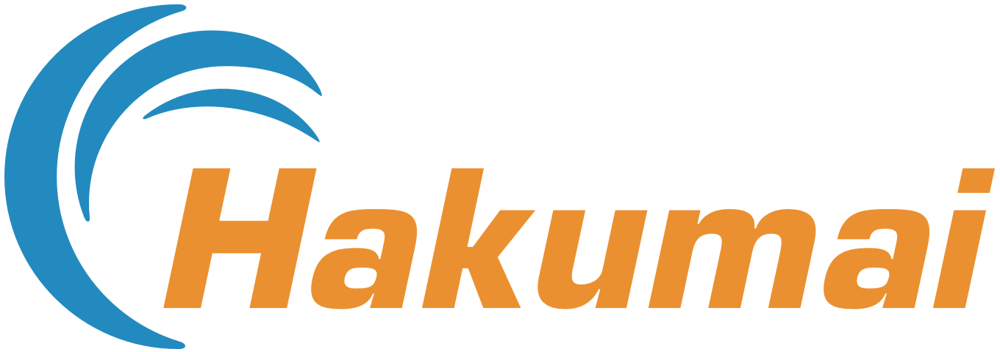
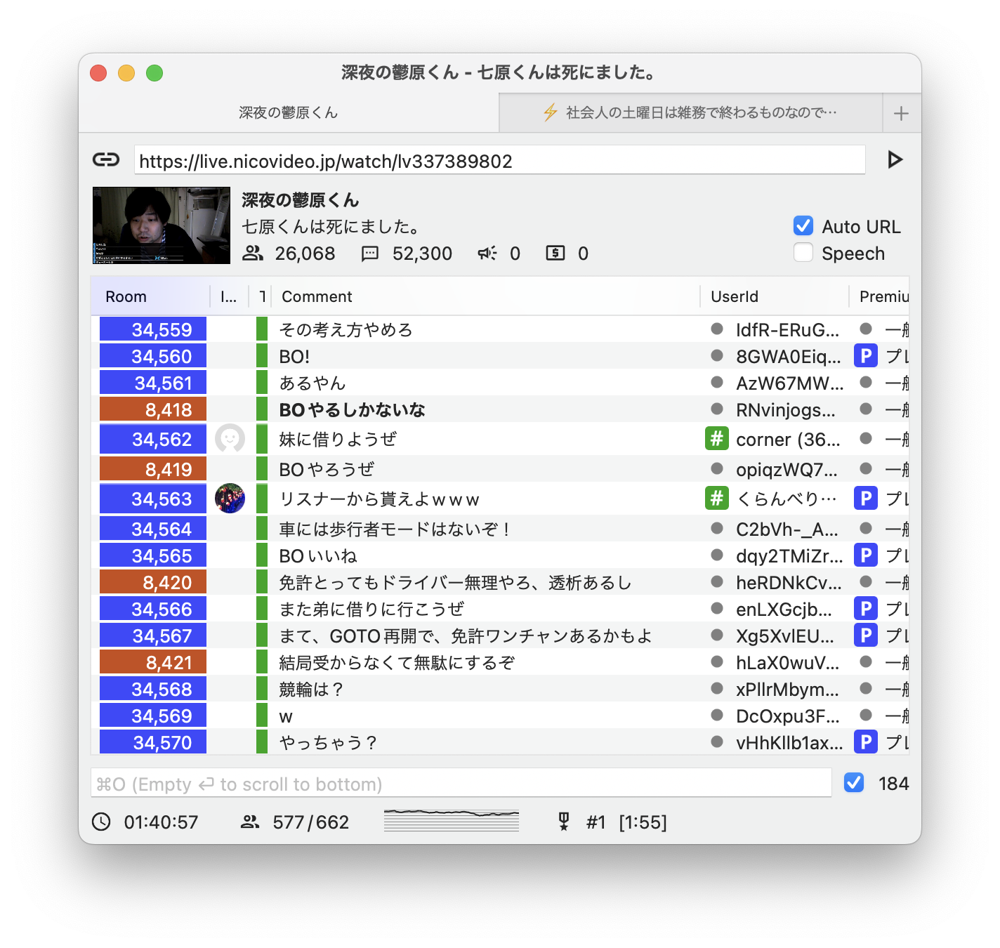

[](https://swift.org/)
[](http://www.opensource.org/licenses/mit-license.php)
[](https://github.com/honishi/Hakumai/actions)

* niconama comment viewer alternative for mac os x.
* download available at [http://honishi.github.io/Hakumai](http://honishi.github.io/Hakumai).



project setup
--
````
bundle install --path=vendor/bundle
bundle exec pod install
open Hakumai.xcworkspace
````

notes about dependencies
--
* `XCGLogger` is general purpose logger.
* `FMDB` is used to query chrome's cookie store in sqlite.
* `SSKeychain` is used to query chrome's encrypt key stored in keychain.
* `Ono` is used to parse html contents.
    * some contents are not properly parsed by `NSXMLDocument`.
* `Sparkle` is automatic software updater.

<!--
contribution
--
1. fork it ( http://github.com//honishi/Hakumai )
2. create your feature branch (`git checkout -b my-new-feature`)
3. commit your changes (`git commit -am 'add some feature'`)
4. push to the branch (`git push origin my-new-feature`)
5. create new pull request
-->

license
--
copyright &copy; 2015- honishi, hiroyuki onishi.

distributed under the [MIT license](http://www.opensource.org/licenses/mit-license.php).
