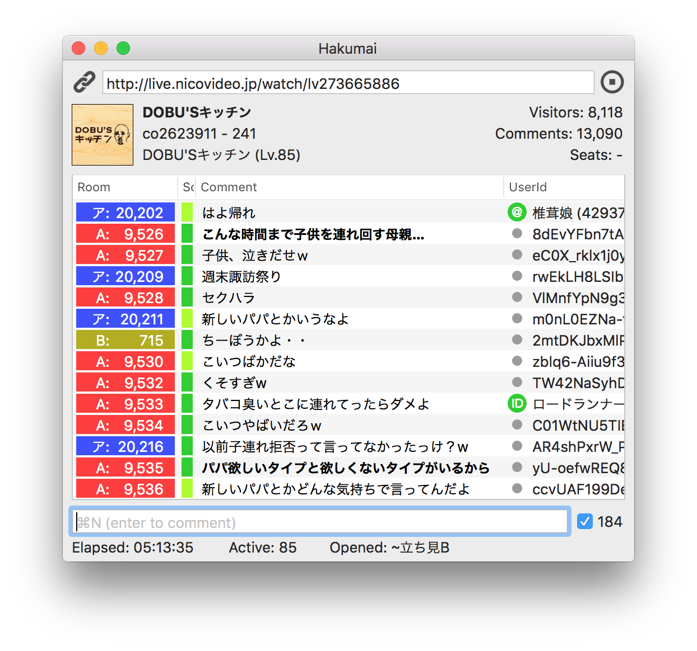

**Niconama Comment Viewer** Alternative for **macOS**.

<a href="https://twitter.com/share" class="twitter-share-button" data-text="Hakumai - Mac用ニコ生コメントビューア">Tweet</a>
<script>!function(d,s,id){var js,fjs=d.getElementsByTagName(s)[0],p=/^http:/.test(d.location)?'http':'https';if(!d.getElementById(id)){js=d.createElement(s);js.id=id;js.src=p+'://platform.twitter.com/widgets.js';fjs.parentNode.insertBefore(js,fjs);}}(document, 'script', 'twitter-wjs');</script>

<a href="https://hakumai.s3.amazonaws.com/Hakumai.{{site.binary_version}}.zip" class="button button-primary" onclick="ga('send', 'event', 'app', 'download', 'Hakumai.{{site.binary_version}}.zip');"><i class="fa fa-download"></i>
Download</a>
v{{site.binary_version}}, {{site.binary_date}} (for macOS 10.12-)

## About Hakumai

Hakumai は macOS で動作するニコニコ生放送用のコメントビューア (コメビュ) です。



### Requirements

* macOS 10.12 Sierra 以降
* (コメント読み上げには macOS 10.14 Mojave 以降が必要)


## Uninstall Hakumai, Completely

```
1. rm /path/to/Hakumai.app
2. rm ~/Library/Preferences/com.honishi.Hakumai.plist
3. rm -r ~/Library/Application\ Support/com.honishi.Hakumai/
4. Keychain Access アプリで "com.honishi.Hakumai.token" を削除
```


## Donation

<div style="text-align: center;">
<a href="https://donation.yahoo.co.jp/" target="_blank">

https://donation.yahoo.co.jp/
</a>
</div>

## Contact

* <a href="http://twitter.com/d3d7x" target="_blank">@d3d7x</a>
  (aka <a href="http://twitter.com/honishi" target="_blank">@honishi</a>)

<div class="github-fork-ribbon-wrapper right fixed" style="width: 150px;height: 150px;position: fixed;overflow: hidden;top: 0;z-index: 9999;pointer-events: none;right: 0;"><div class="github-fork-ribbon" style="position: absolute;padding: 2px 0;background-color: #333;background-image: linear-gradient(to bottom, rgba(0, 0, 0, 0), rgba(0, 0, 0, 0.15));-webkit-box-shadow: 0 2px 3px 0 rgba(0, 0, 0, 0.5);-moz-box-shadow: 0 2px 3px 0 rgba(0, 0, 0, 0.5);box-shadow: 0 2px 3px 0 rgba(0, 0, 0, 0.5);z-index: 9999;pointer-events: auto;top: 42px;right: -43px;-webkit-transform: rotate(45deg);-moz-transform: rotate(45deg);-ms-transform: rotate(45deg);-o-transform: rotate(45deg);transform: rotate(45deg);"><a href="https://github.com/honishi/Hakumai" style="font: 700 13px &quot;Helvetica Neue&quot;, Helvetica, Arial, sans-serif;color: #fff;text-decoration: none;text-shadow: 0 -1px rgba(0, 0, 0, 0.5);text-align: center;width: 200px;line-height: 20px;display: inline-block;padding: 2px 0;border-width: 1px 0;border-style: dotted;border-color: rgba(255, 255, 255, 0.7);" target="_blank">Fork me on GitHub</a></div></div>

## Special Thanks

<div class="thanks">

あすぷす / イノシシ / うまごん / うんさい / 大原直人 / 加瀬ちゃん / きょろちゃん / ジャスティス名川 / とろみ / 七原浩平 / ビッグニート / 向日葵 / ヘクトパスカル山田 / もっちゃん / 森一真 / らみあ
/ りーこ

</div>